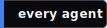

<div align="center">

<picture>
  <source media="(prefers-color-scheme: dark)" srcset="docs/img/banner.svg">
  <source media="(prefers-color-scheme: light)" srcset="docs/img/banner.svg">
  
</picture>

<br/>

### *One skill. Every agent. 45 of them.*

<br/>

[](https://www.npmjs.com/package/skillkit)
[](https://www.npmjs.com/package/skillkit)
[](https://github.com/rohitg00/skillkit/stargazers)
[](https://github.com/rohitg00/skillkit/actions/workflows/ci.yml)
[](LICENSE)

<br/>

<a href="https://skillkit.sh"></a>
<a href="#supported-agents"></a>
<a href="#skill-sources"></a>

<a href="LICENSE"></a>
<a href="CONTRIBUTING.md"></a>

<br/>

<a href="#full-vs-slim"></a>
<a href="https://github.com/rohitg00/skillkit/releases/latest"></a>




<sub>Tags are SVGs under <a href="assets/tags/"><code>/assets/tags/</code></a>. Fork and remix.</sub>

<br/>

### Quick nav

[**Quick start**](#quick-start) · [**Install**](#install) · [**Commands**](#commands) · [**Agents**](#supported-agents) · [**Sources**](#skill-sources) · [**API**](#programmatic-api) · [**Website**](https://skillkit.sh)

</div>

---

<div align="center">

https://github.com/user-attachments/assets/b1843a07-2c54-422d-8903-f30a790cfb37

</div>

## The problem

Every AI coding agent wants skills. Every agent invented a different format.

<table>
<tr>
<th>Agent</th>
<th>Format</th>
<th>Directory</th>
</tr>
<tr><td>Claude Code</td><td><code>SKILL.md</code></td><td><code>.claude/skills/</code></td></tr>
<tr><td>Cursor</td><td><code>.mdc</code></td><td><code>.cursor/skills/</code></td></tr>
<tr><td>Copilot</td><td>Markdown</td><td><code>.github/skills/</code></td></tr>
<tr><td>Windsurf</td><td>Markdown</td><td><code>.windsurf/skills/</code></td></tr>
<tr><td colspan="3"><i>... 41 more</i></td></tr>
</table>

You rewrite the same skill for each agent. Or you lock in to one.

## The fix

SkillKit is the package manager for AI agent skills. Install from 400K+ skills across 31 sources. Auto-translate between formats. Persist session learnings. Ship to 45 agents at once.

```bash
npx skillkit add anthropics/skills
```

That is the whole first-run. Pick your agent (your detected agent is pre-selected), confirm, done.

## Quick start

```bash
npx skillkit init                     # detect agent, create dirs
skillkit recommend                    # stack-aware suggestions
skillkit add anthropics/skills        # install from marketplace
skillkit sync                         # deploy to agent config
```

Four commands. Your agent now has PDF processing, code review, auth patterns, and whatever you need.

### What the first install looks like

```
$ npx skillkit add anthropics/skills

 ◇ Detected 32 agents
 │
 ◆ Install to
 │  ● Just Claude Code (detected)      claude-code
 │  ○ Select specific agents           space to toggle
 │  ○ All supported agents             32 agents, writes to every adapter
 └

 ◇ Cloning anthropics/skills
 ◇ Security scan: 42/42 skills pass
 ◇ Installed 42 skills to Claude Code
 │
 └ Done in 3.1s. Run `skillkit list` to see them.
```

## Install

Pick one. All three do the same thing.

```bash
npm install -g skillkit       # npm
pnpm add -g skillkit          # pnpm
bun add -g skillkit           # bun
```

Both `skillkit` and `sk` work as the binary name.

### Full vs slim

Four features ship as optional packages so a bare CLI stays small. The default install pulls everything. Add `--omit=optional` if you only want the core.

| Feature         | Package                | Command          |
| :-------------- | :--------------------- | :--------------- |
| Terminal UI     | `@skillkit/tui`        | `skillkit ui`    |
| REST server     | `@skillkit/api`        | `skillkit serve` |
| Peer mesh       | `@skillkit/mesh`       | `skillkit mesh`  |
| Agent messaging | `@skillkit/messaging`  | `skillkit message` |

Cold install numbers on a fresh npm cache:

<p align="center">
  
  
  
</p>

| Mode                                | Packages | Time | Vulns (crit/high) |
| :---------------------------------- | -------: | :--: | ----------------: |
| `npm i -g skillkit`                 |      418 |  18s |               0/0 |
| `npm i -g skillkit --omit=optional` |      118 |   9s |               0/0 |

Skipped optional? Add just the one you want later:

```bash
npm i -g @skillkit/tui         # enables: skillkit ui
npm i -g @skillkit/api         # enables: skillkit serve
npm i -g @skillkit/mesh        # enables: skillkit mesh
npm i -g @skillkit/messaging   # enables: skillkit message
```

The CLI catches missing optional packages and prints a one-line hint. No stack trace.

### Using `npx`

`npx skillkit add <owner/repo>` works with zero install. First call caches the package under `~/.npm/_npx/`. Every run after that is instant until a new version ships.

```bash
npx skillkit add anthropics/skills                    # full
npx --omit=optional skillkit add anthropics/skills    # slim
```

If you reach for `npx skillkit` more than twice, switch to a global install. Kills the prompt-to-proceed and the per-release refetch.

## What you can do

<details open>
<summary><b>Install from anywhere</b></summary>

```bash
skillkit add anthropics/skills           # GitHub
skillkit add gitlab:team/skills          # GitLab
skillkit add ./my-local-skills           # local path
skillkit add https://gist.github.com/... # gist
```
</details>

<details>
<summary><b>Translate between agents</b></summary>

Write once for Claude, ship everywhere:

```bash
skillkit translate my-skill --to cursor
skillkit translate --all --to windsurf,codex
skillkit translate my-skill --to copilot --dry-run
```
</details>

<details>
<summary><b>Stack-aware recommendations</b></summary>

SkillKit reads your repo, spots your stack, ranks skills:

```bash
$ skillkit recommend

  92% vercel-react-best-practices
  87% tailwind-v4-patterns
  85% nextjs-app-router
  81% shadcn-ui-components
```
</details>

<details>
<summary><b>Runtime skill discovery (REST)</b></summary>

Start the server, let agents fetch skills on demand:

```bash
skillkit serve
# http://localhost:3737

curl "http://localhost:3737/search?q=react+performance"
```

Or wire it up with MCP:

```json
{
  "mcpServers": {
    "skillkit": { "command": "npx", "args": ["@skillkit/mcp"] }
  }
}
```

Or call from Python:

```python
from skillkit import SkillKitClient

async with SkillKitClient() as client:
    results = await client.search("react performance", limit=5)
```

[REST docs](https://skillkit.sh/docs/rest-api) · [MCP docs](https://skillkit.sh/docs/mcp-server) · [Python client](https://skillkit.sh/docs/python-client)
</details>

<details>
<summary><b>Auto-generate agent instructions</b></summary>

Analyze the codebase and write CLAUDE.md, `.cursorrules`, AGENTS.md, and friends:

```bash
skillkit primer --all-agents
```
</details>

<details>
<summary><b>Session memory</b></summary>

AI agents learn during a session, then forget. SkillKit captures what they learned:

```bash
skillkit memory compress
skillkit memory search "auth patterns"
skillkit memory export auth-patterns
```
</details>

<details>
<summary><b>AI skill generation</b></summary>

Generate skills from plain English with multi-source context:

```bash
skillkit generate
```

Pulls context from four places: Context7 docs, your codebase, 400K marketplace skills, your memory. Works with Claude, GPT-4, Gemini, Ollama (local), or any OpenRouter model.
</details>

<details>
<summary><b>Team collaboration</b></summary>

Share skills via a committable `.skills` manifest:

```bash
skillkit manifest init
skillkit manifest add anthropics/skills
git commit -m "add team skills"
```

Everyone else runs `skillkit manifest install` and matches state.
</details>

<details>
<summary><b>Mesh network</b></summary>

Distribute agents across machines with encrypted P2P:

```bash
skillkit mesh init
skillkit mesh discover
```
</details>

<details>
<summary><b>Chrome extension</b></summary>

Save any webpage as a skill from the browser. Click the extension, the page round-trips through the SkillKit API (Turndown, 5-source tag detection, GitHub URL support), the `SKILL.md` downloads, then run `skillkit add ~/Downloads/skillkit-skills/<name>`.

[Extension docs](https://skillkit.sh/docs/chrome-extension)
</details>

<details>
<summary><b>Interactive TUI</b></summary>

```bash
skillkit ui
```

<sub><code>h</code> home · <code>m</code> marketplace · <code>r</code> recommend · <code>t</code> translate · <code>i</code> installed · <code>s</code> sync · <code>q</code> quit</sub>


</details>

## Commands

<details open>
<summary><b>Core</b></summary>

```bash
skillkit add <source>            # install skills (live progress)
skillkit remove <skills>         # remove
skillkit remove --source org/repo # bulk by source
skillkit remove --all            # remove everything
skillkit update                  # update (change detection)
skillkit check                   # updates, quality, activity
skillkit translate <skill> --to  # agent format conversion
skillkit sync                    # deploy to agent config
skillkit recommend               # smart recommendations
skillkit generate                # AI skill wizard
skillkit serve                   # REST API server
skillkit publish submit          # publish to marketplace
```
</details>

<details>
<summary><b>Discovery & security</b></summary>

```bash
skillkit marketplace             # browse
skillkit tree                    # taxonomy
skillkit find <query>            # quick search
skillkit scan <path>             # security scan
```
</details>

<details>
<summary><b>Custom sources</b></summary>

```bash
skillkit tap add owner/repo
skillkit tap list
skillkit tap remove owner/repo
```
</details>

<details>
<summary><b>Issue planner</b></summary>

```bash
skillkit issue plan "#42"
skillkit issue plan owner/repo#42
skillkit issue list
```
</details>

<details>
<summary><b>Session intelligence</b></summary>

```bash
skillkit timeline                # unified event stream
skillkit session handoff         # agent-to-agent context
skillkit lineage                 # skill impact graph
skillkit session explain         # human summary
skillkit activity                # activity log
```
</details>

<details>
<summary><b>Advanced</b></summary>

```bash
skillkit primer --all-agents     # agent instruction files
skillkit memory compress         # capture session learnings
skillkit mesh init               # multi-machine distribution
skillkit message send            # inter-agent messaging
skillkit workflow run <name>     # run workflows
skillkit test                    # test skills
skillkit cicd init               # CI/CD templates
```
</details>

[Full command reference](https://skillkit.sh/docs/commands)

## Supported agents

<details open>
<summary><b>Top 11</b></summary>

| Agent              | Format     | Directory          |
| :----------------- | :--------- | :----------------- |
| **Claude Code**    | `SKILL.md` | `.claude/skills/`  |
| **Cursor**         | `.mdc`     | `.cursor/skills/`  |
| **Codex**          | `SKILL.md` | `.codex/skills/`   |
| **Gemini CLI**     | `SKILL.md` | `.gemini/skills/`  |
| **OpenCode**       | `SKILL.md` | `.opencode/skills/`|
| **GitHub Copilot** | Markdown   | `.github/skills/`  |
| **Windsurf**       | Markdown   | `.windsurf/skills/`|
| **Devin**          | Markdown   | `.devin/skills/`   |
| **Aider**          | `SKILL.md` | `.aider/skills/`   |
| **Cody**           | `SKILL.md` | `.cody/skills/`    |
| **Amazon Q**       | `SKILL.md` | `.amazonq/skills/` |
</details>

<details>
<summary><b>Plus 34 more</b></summary>

Amp, Antigravity, Augment Code, Bolt, Clawdbot, Cline, CodeBuddy, CodeGPT, CommandCode, Continue, Crush, Droid, Factory, Goose, Kilo Code, Kiro CLI, Lovable, MCPJam, Mux, Neovate, OpenClaw, OpenHands, Pi, PlayCode, Qoder, Qwen, Replit Agent, Roo Code, Tabby, Tabnine, Trae, Vercel, Zencoder, Universal.
</details>

[Full agent details](https://skillkit.sh/docs/agents)

## Creating skills

```bash
skillkit create my-skill
```

Or author a `SKILL.md` by hand:

```markdown
---
name: my-skill
description: What this skill does
license: MIT
---

# My Skill

Instructions for the agent.

## When to use
- scenario 1
- scenario 2

## Steps
1. first
2. second
```

## Programmatic API

```ts
import { translateSkill, analyzeProject, RecommendationEngine } from 'skillkit';

const skill = await translateSkill(content, 'cursor');

const profile = await analyzeProject('./my-project');
const engine = new RecommendationEngine();
const recs = await engine.recommend(profile);
```

```ts
import { startServer } from '@skillkit/api';
await startServer({ port: 3737, skills: [...] });
```

```ts
import { MemoryCache, RelevanceRanker } from '@skillkit/core';
const cache = new MemoryCache({ maxSize: 500, ttlMs: 86_400_000 });
const ranker = new RelevanceRanker();
const results = ranker.rank(skills, 'react performance');
```

## Skill sources

All original creators credited. Licenses preserved. PRs welcome.

### Official partners

| Repository | What |
|:-----------|:-----|
| [anthropics/skills](https://github.com/anthropics/skills) | Official Claude Code skills |
| [vercel-labs/agent-skills](https://github.com/vercel-labs/agent-skills) | Next.js, React |
| [expo/skills](https://github.com/expo/skills) | Expo mobile |
| [remotion-dev/skills](https://github.com/remotion-dev/skills) | Programmatic video |
| [supabase/agent-skills](https://github.com/supabase/agent-skills) | Database, auth |
| [stripe/ai](https://github.com/stripe/ai) | Payments |

### Community

[trailofbits/skills](https://github.com/trailofbits/skills) · [obra/superpowers](https://github.com/obra/superpowers) · [wshobson/agents](https://github.com/wshobson/agents) · [ComposioHQ/awesome-claude-skills](https://github.com/ComposioHQ/awesome-claude-skills) · [travisvn/awesome-claude-skills](https://github.com/travisvn/awesome-claude-skills) · [langgenius/dify](https://github.com/langgenius/dify) · [better-auth/skills](https://github.com/better-auth/skills) · [onmax/nuxt-skills](https://github.com/onmax/nuxt-skills) · [elysiajs/skills](https://github.com/elysiajs/skills) · [kadajett/agent-nestjs-skills](https://github.com/kadajett/agent-nestjs-skills) · [cloudai-x/threejs-skills](https://github.com/cloudai-x/threejs-skills) · [dimillian/skills](https://github.com/dimillian/skills) · [waynesutton/convexskills](https://github.com/waynesutton/convexskills) · [kepano/obsidian-skills](https://github.com/kepano/obsidian-skills) · [giuseppe-trisciuoglio/developer-kit](https://github.com/giuseppe-trisciuoglio/developer-kit) · [openrouterteam/agent-skills](https://github.com/openrouterteam/agent-skills)

**Want your skills listed?** [Submit your repo](https://github.com/rohitg00/skillkit/issues/new?template=add-source.md).

## Contributing

Issues and PRs land fast. See [CONTRIBUTING.md](CONTRIBUTING.md) for the short version.

## License

Apache 2.0. See [LICENSE](LICENSE).

<br/>

<div align="center">

[**Docs**](https://skillkit.sh/docs) · [**Website**](https://skillkit.sh) · [**API Explorer**](https://skillkit.sh/api) · [**npm**](https://www.npmjs.com/package/skillkit) · [**GitHub**](https://github.com/rohitg00/skillkit)

<sub>Built for agents. Written by humans.</sub>

</div>
